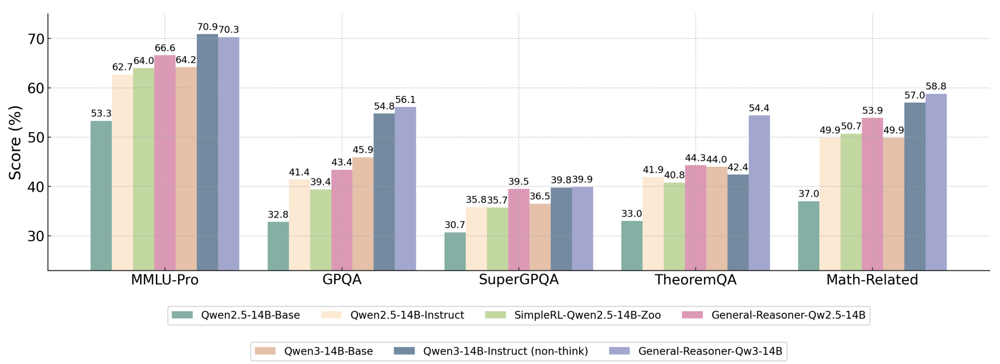
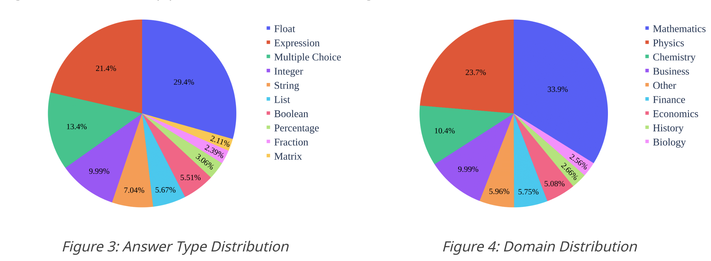

# General-Reasoner: Advancing LLM Reasoning Across All Domains (beyond Math)


🪡 We introduce a novel framework within GRPO to utilize model-based verifier to support wider range of answer types. We train on WebInstruct-verfied, a dataset covering wide range of reasoning topics beyond math. We demonstrate substantial improvements over traditional binary rule-based rewards across diverse domains beyond math. 

✅ Model-based verifier to support verification of diverse answer types like math expression, string, list, fraction, matrix, etc;<br>
✅ Small 7B/14B models achieve robust cross-domain rewards; It boosts MMLU-Pro performance by 13%.<br>
✅ Our method does not require any additional SFT.

Check out our [Arxiv Paper](https://arxiv.org/abs/2505.14652) for the details!

## Highlights

Our experimental results are as follows:

<p float="left">
  
</p>

Our discpline distribution is described as follows:

<p float="left">
  
</p>

Our model-based verifier helps scaling the verifiable reasoning questions:

<p float="left">
  
</p>


---

## Resources

### Training Data

|Data|Size|Link|
|-|-|-|
|WebInstruct-verified| 230k | [🤗](https://huggingface.co/datasets/TIGER-Lab/WebInstruct-verified)|


### General Verifier

|Model|Backbone|Link|
|-|-|-|
|General-Verifier|Qwen/Qwen2.5-Math-1.5B|[🤗](https://huggingface.co/TIGER-Lab/general-verifier)|

Check out HF page to learn how to use it. Feel free to plug this into your current RL-training framework. 

### Model Checkpoint

|Model|Backbone|Link|
|-|-|-|
|General-Reasoner-Qwen2.5-7B|Qwen2.5-7B-Base|[🤗](https://huggingface.co/TIGER-Lab/General-Reasoner-Qwen2.5-7B)|
|General-Reasoner-Qwen2.5-14B|Qwen2.5-14B-Base|[🤗](https://huggingface.co/TIGER-Lab/General-Reasoner-Qwen2.5-14B)|
|General-Reasoner-Qwen3-4B|Qwen3-4B-Base|[🤗](https://huggingface.co/TIGER-Lab/General-Reasoner-Qwen3-4B)|
|General-Reasoner-Qwen3-14B|Qwen3-14B-Base|[🤗](https://huggingface.co/TIGER-Lab/General-Reasoner-Qwen3-14B)|
---

## Installation

```bash
pip install torch==2.4.0 --index-url https://download.pytorch.org/whl/cu124
pip install flash-attn --no-build-isolation
pip install -e ./verl
pip install vllm==0.8.3
pip install flashinfer-python
pip install math-verify
```

---

## Training

### 1. Prepare Data
```bash
python data_preprocess.py --local-dir <data_dir>/webinstruct-verified
```

### 2. Download Verifier
```bash
huggingface-cli download TIGER-Lab/general-verifier --local-dir <data_dir>/general-reasoner-verifier
```

### 3. Download Backbone Model
```bash
huggingface-cli download Qwen/Qwen2.5-7B --local-dir <data_dir>/Qwen2.5-7B
```

### 4. Configure Training Script
Edit the environment variables in `train_general_reasoner.sh` to fit your system setup.

### 5. Launch Ray Cluster
```bash
ray start --address <MASTER-NODE-IP>:6379
```

### 6. Start Training
```bash
bash train_general_reasoner.sh
```

---

## Evaluation

### MMLU-PRO:

```bash
python -m evaluation.eval_mmlupro \
    --model_path TIGER-Lab/General-Reasoner-14B \
    --output_file output-mmlupro-General-Reasoner-14B.json
```

### SuperGPQA:

```bash
python -m evaluation.eval_supergpqa \
    --model_path TIGER-Lab/General-Reasoner-14B \
    --output_file output-supergpqa-General-Reasoner-14B.json
```

### Math-Related Tasks & GPQA
We evaluate math and GPQA tasks using the `simple-eval` framework.
For non-multiple choice questions, answer equivalence is verified using `GPT-4o`.

#### 1. Configure OpenAI Key
```bash
export OPENAI_API_KEY=<replace by OPENAI API KEY>
```

#### 2. Serve the Model
```bash
vllm serve TIGER-Lab/General-Reasoner-14B --tensor-parallel-size 4
```

#### 3. Run Evaluation
```bash
python -m evaluation.simple-evals.run_simple_evals_qwen \
    --model General-Reasoner-14B
```

> By default, the model uses greedy decoding.
> For AIME24 and AIME25, scores are averaged over 32 runs with temperature 1.
> For more configuration details, refer to `evaluation/simple-evals/run_simple_evals_qwen.py`.


---

## Detailed Results

Our 7B and 14B models are trained from the corresponding base qwen models.


### General results

| Model Name                   | MMLU-Pro | GPQA     | SuperGPQA | TheoremQA | BBEH     |
| ---------------------------- | -------- | -------- | --------- | --------- | -------- |
| Qwen2.5-7B-Base              | 47.7     | 25.8     | 26.7      | 29.1      | 8.0      |
| Qwen2.5-7B-Instruct          | 57.0     | 33.8     | 30.7      | 36.6      | 12.2     |
| SimpleRL-Qwen2.5-7B-Zoo      | 51.5     | 24.2     | 29.9      | 38.0      | 11.9     |
| **General-Reasoner-7B**      | **58.9** | **34.3** | **34.2**  | **45.3**  | **12.5** |
|                              |          |          |           |           |          |
| Qwen2.5-14B-Base             | 53.3     | 32.8     | 30.7      | 33.0      | 10.8     |
| Qwen2.5-14B-Instruct         | 62.7     | 41.4     | 35.8      | 41.9      | 15.2     |
| SimpleRL-Qwen2.5-14B-Zoo     | 64.0     | 39.4     | 35.7      | 40.8      | 13.6     |
| **General-Reasoner-14B**     | **66.6** | **43.4** | **39.5**  | **44.3**  | **15.2** |
|                              |          |          |           |           |          |
| Qwen3-4B-Base                | 51.6     | 26.3     | 25.4      | 34.8      | 8.1      |
| Qwen3-4B-Instruct            | 61.8     | 41.7     | 32.1      | 42.0      | **14.9** |
| **General-Reasoner-Qw3-4B**  | **62.8** | **42.9** | **32.5**  | **48.3**  | 12.2     |
|                              |          |          |           |           |          |
| Qwen3-14B-Base               | 64.2     | 45.9     | 36.5      | 44.0      | 13.0     |
| Qwen3-14B-Instruct           | **70.9** | 54.8     | 39.8      | 42.4      | **19.2** |
| **General-Reasoner-Qw3-14B** | 70.3     | **56.1** | **39.9**  | **54.4**  | 17.3     |


### Math-related results

| Model Name                   | MATH-500 | Olympiad | Minerva | GSM8K | AMC  | AIME24x32 | AIME25x32 |
| ---------------------------- | -------- | -------- | ------- | ----- | ---- | --------- | --------- |
| Qwen2.5-7B-Base              | 60.2     | 28.6     | 36.0    | 83.1  | 30.0 | 3.8       | 1.4       |
| Qwen2.5-7B-Instruct          | 75.0     | 39.4     | 45.2    | 90.9  | 52.5 | 12.5      | 8.5       |
| SimpleRL-Qwen2.5-7B-Zoo      | 74.0     | 41.9     | 49.6    | 90.7  | 60.0 | 15.2      | 7.5       |
| **General-Reasoner-7B**      | 76.0     | 37.9     | 54.0    | 92.7  | 55.0 | 13.8      | 10.4      |
|                              |          |          |         |       |      |           |           |
| Qwen2.5-14B-Base             | 65.4     | 33.5     | 24.3    | 91.6  | 37.5 | 3.6       | 2.9       |
| Qwen2.5-14B-Instruct         | 77.4     | 44.7     | 52.2    | 94.5  | 57.5 | 12.2      | 11.0      |
| SimpleRL-Qwen2.5-14B-Zoo     | 77.2     | 44.6     | 54.0    | 94.2  | 60.0 | 12.9      | 11.8      |
| **General-Reasoner-14B**     | 78.6     | 42.1     | 58.1    | 94.2  | 70.0 | 17.5      | 16.9      |
|                              |          |          |         |       |      |           |           |
| Qwen3-4B-Base                | 68.2     | 34.8     | 42.3    | 72.6  | 47.5 | 10.3      | 6.7       |
| Qwen3-4B-Instruct(non-think) | 80.4     | 49.0     | 57.0    | 92.0  | 62.5 | 22.5      | 16.1      |
| **General-Reasoner-Qw3-4B**  | 80.6     | 47.7     | 57.7    | 92.2  | 60.0 | 20.0      | 15.4      |
|                              |          |          |         |       |      |           |           |
| Qwen3-14B-Base               | 74.6     | 44.3     | 55.9    | 93.2  | 55.0 | 14.7      | 11.4      |
| Qwen3-14B-Instruct(non-think)| 82.0     | 52.4     | 59.9    | 93.9  | 57.5 | 28.5      | 25.1      |
| **General-Reasoner-Qw3-14B** | 83.8     | 51.9     | 68.0    | 94.4  | 70.0 | 24.4      | 19.2      |


## Acknowledgements

This project is built upon the following open-source projects:

- [VERL](https://github.com/volcengine/verl/tree/main/verl)  
- [simpleRL-reason](https://github.com/hkust-nlp/simpleRL-reason)  
- [simple-evals](https://github.com/openai/simple-evals)


## Citation

```tex
@article{general-reasoner,
      title={General-Reasoner: Advancing LLM Reasoning Across All Domains}, 
      author={Xueguang Ma and Qian Liu and Dongfu Jiang and Ge Zhang and Zejun Ma and Wenhu Chen},
      year={2025},
      journal={arXiv:2505.14652},
      url={https://arxiv.org/abs/2505.14652}, 
}
```
